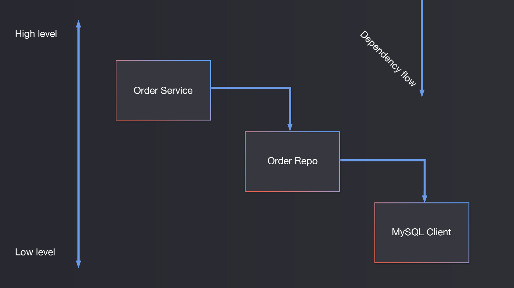
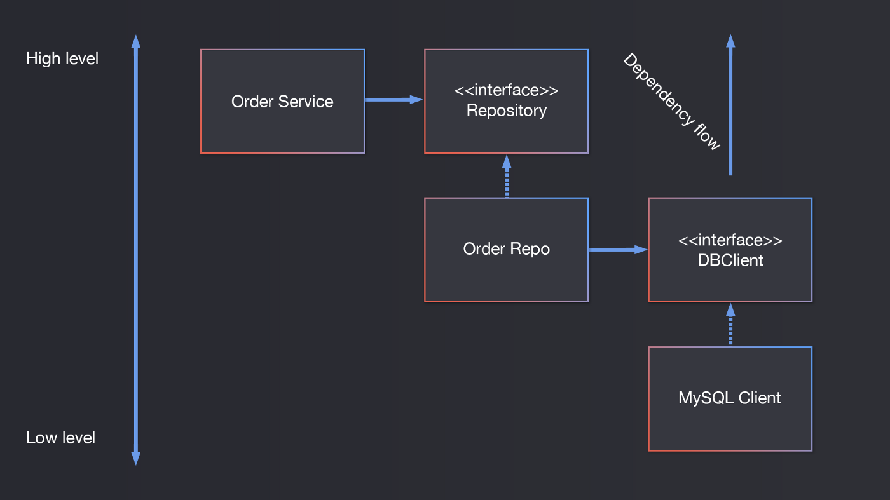

# IoC vs DI vs DIP

## IoC

### IoC란?

Inversion of Control이란 말 그대로 제어의 흐름을 바꾸는 프로그래밍 기법이다.

IoC의 핵심은 **`언제`와 `무엇을`을 분리**하고 **`언제`와  `무엇을`이 서로 최대한 모르게 하는 것**이다.

<br>

A 클래스와 B 클래스가 있다고 가정해보자.

A 클래스는 B 클래스에 의존하고 있는데, IoC를 사용하지 않으면 A 클래스에서 B 클래스의 메소드를 직접 호출하게 되어 A는 B를 의존하게 된다.

하지만 IoC를 사용하게 되면 A 클래스는 생성자로 B를 받게 된다.

이렇듯 객체 생성자로 넣든, 파라미터로 넣든 어떤 동작을 할지 프레임워크 등 외부에서 결정하도록 한다.

> 객체를 만들어 필요한 곳에 넣어주는걸 IoC Container라고 부른다.
>
> IoC Container 없이도 PureDI와 같이 IoC(DI)를 구현할 수. 있다.

### IoC 예시

로봇을 만드는 기계가 있다고 가정해보자.

이 기계는 로봇과 매우 강하게 결합되어 있어, 다른 무엇도 만들 수 없기 때문에 다른 로봇이 필요하다면, 기계를 새로 사야 한다.

<br>

그렇다면 로봇을 만드는 기계가 아닌 사용자의 모델링대로 출력해주는 3D 프린터가 있다고 가정해보자.

사용자가 모델링만 제대로 해서 넣어주게 되면, 그대로 만들어서 출력해 준다.

<br>

기존의 로봇을 만드는 기계는 해당 로봇에게 강하게 결합되어 있다고 할 수 있다.

하지만 3D 프린터를 사용함으로써 **무엇을 만들지에 대한 제어권이 사용자에게 넘어갔다.**

사용자는 어떤 과정을 거쳐서 내 모델링을 만드는지 전혀 관심이 없다.

단지 사용자의 모델링대로 출력해 줄 것이라고 믿을 뿐이다.

<br>

또한 구현체가 아닌 인터페이스에 의존하게 강제하는 규약이기도 하다.

우리는 3D 프린터가 원하는 인터페이스를 구현하는 모델링을 해야한다.

<br>

## DI

### DI란?

Dependency Injection이란 **의존 관계를 주입시키는 것**이다.

IoC는 너무 추상적이어 이해하기 어렵기 때문에 여러 주장을 수합한 끝에 Dependency Injection이라는 것을 만들었다고 한다.

하지만 Dependency Injection 말고 Service Locator 등 다른 패턴들로도 사용할 수 있다.

### 예제

다음과 같은 DI가 적용되지 않은 클래스가 있다고 가정해보자.

``` java
public class TextEditor {
    private final SpellChecker checker;

    public TextEditor() {
        this.checker = new SpellChecker();
    }
}
```

이런 방식을 사용하게 되면 TextEditor와 SpellChecker는 매우 강하게 결합되게 된다.

그러므로 다음과 같이 바꿔주면 좋다.

``` java
public class TextEditor {
    private final IocSpellChecker checker;

    public TextEditor(IocSpellChecker checker) {
        this.checker = checker;
    }
}
```

위 코드에서는 아까전처럼 SpellChecker를 직접 생성하는게 아니라, 생성자로 받아오게 바꿨다.

이제 TextEditor를 호출할 때에는 다음과 같이 사용할 수 있다.

``` java
SpellChecker sc = new SpellChecker(); // dependency
TextEditor textEditor = new TextEditor(sc);
```

이제 우리는 TextEditor 객체를 생성하는 쪽에서 생성자 파라미터로 뭐가 들어갈지, 즉 동작을 제어할 수 있다.

<br>

이제 메소드를 호출하는 쪽 에서는 무엇을 호출하는지 모르고, 객체를 생성하는 생성자로 넘겨주기만 하기 때문에 언제 호출되는지는 모른다.

반대로 호출되는 쪽에서는 언제 실행할지는 알지만, 무엇을 실행할지는 모르게 된다.

## DIP

### DIP란

SOLID의 마지막에 있는 Dependency Inversion Principle로, 의존성을 역전시켜야 한다는 규칙이다.

Agile Software Development Principles에서는 다음 두 가지 규칙을 설명한다.

- 고수준의 모듈은 저수준에 의존하면 안되고, 둘 다 추상화에 의존해야 한다.
- 추상화가 세부 사항에 의존하면 안되고, 세부 사항이 추상화에 의존해야 한다.

이제 이걸 좀 더 자세히 알아보자.

<br>

위 규칙에서 말하는 `고수준의 모듈`은 특정 기능을 제공하는 저수준 모듈에 의존하는, 서비스의 클라이언트라고 할 수 있다.

대부분 서비스의 중요한 규칙이나 비지니스 로직을 담고있다.

반대로 `저수준의 모듈`은 클라이언트에게 특정 기능을 제공하는 클래스이다.

<br>

만약 고수준의 모듈이 서비스의 구현체에 의존하고 있었는데, 저수준 모듈의 인터페이스가 바뀌게 되면 어떻게 될까?

결과적으로 Client와 테스트도 전부 바꿔줘야 한다.

하지만 고수준 모듈에서 저수준 모듈이 구현해야 하는 인터페이스를 결정한다면, 의존 관계가 역전되게 된다.

주의할 점은 **고수준 모듈에서 저수준 모듈의 인터페이스를 가지고 있다는 것**이다.

<br>

다음은 고수준의 모듈이 저수준의 모듈에 의존하고 있기 때문에 DIP를 위반한 사례이다.



그 대신 다음과 같이 바꿔줘야 한다.



이렇게 하면 저수준의 Order Repo는 고수준이 가진 Repository 인터페이스에 의존하게 된다.

<br>

추상화에 의존하게 될 때에는 다음과 같은 규칙이 있다.

- 고수준의 모듈은 종속된 클래스가 뭔지는 알 수 없다. 그 대신, 그 클래스가 무엇을 하는지에 의존해야 한다.
- 종속된 클래스는 상위 수준에서 결정된 방식으로 동작함을 보장한다.
- 종속된 클래스는 언제든지 다른 클래스로 바뀔 수 있다.
- 고수준의 모듈은 언제나 다른 곳에서 안전하게 재사용될 수 있으며, Contract를 지킬 것이라고 믿는다.

<br>

# 예제

이제 직접 TS로 예제를 만들어 살펴보자.

> 코드가 간단하기 때문에 쉽게 읽을 수 있다.

``` tsx
class MySQLOrderReporitory {

    private mapper: OrderMapper;
    private client: MysqlClient;

    constructor() {
        this.client = new MysqlClient();
        this.mapper = new OrderMapper();
    }


    public async save(order: Order): Promise<void> {
        const orderRecord = this.mapper.toPersistence(order);
        await this.client.insert(orderRecord);
    }

    public async fetch(orderId: string): Promise<Order> {
        const orderRecord = await this.client.getById(orderId);
        return this.mapper.toDomain(orderRecord);
    }
}

class OrderService {

    public async placeOrder(orderCommand: OrderCommand): Promise<void> {
        const order = Order.create(orderCommand);        
        order.place();

        const repository = new OrderMySQLRepository();
        repository.save(order);
    }
}
```

여기서는 OrderService에서 OrderMySQLRepository 객체를 직접 생성하기 때문에 매우 강한 결합도를 가진다.

그럼 이제 DI를 적용하여 코드를 개선해보자.

> TS의 Container를 통해 주입해주었따.

``` tsx
@injectable()
class MySQLOrderReporitory {

    private _mysqlClient: MysqlClient;
    private _mapper: OrderMapper;

    constructor(
        @inject('MysqlClient') mysqlClient: MysqlClient,
        @inject('OrderMapper') mapper: OrderMapper,
    ) {
        this._mysqlClient = mysqlClient;
        this._mapper = mapper;
    }

    public async save(order: Order): Promise<void> {
        // ...
    }

    public async fetch(orderId: string): Promise<Order> {
        // ...
    }
}

class OrderService {

    private _repository: OrderMySQLRepository;

    constructor(
        @inject('MySQLOrderReporitory') repository: OrderMySQLRepository
    ) {
        this._repository = repository;
    }

    public async placeOrder(orderCommand: OrderCommand): Promise<void> {
        const order = Order.create(orderCommand);
        order.place();

        this._repository.save(order);
    }
}
```

이제 고수준의 모듈에서 저수준의 모듈 객체를 직접 초기화하지는 않는다.

의존도가 낮아지긴 했지만 여전히 OrderService는 구현체에 의존하고 있기 때문에, 의존성이 역전되지는 않았다.

이제 인터페이스를 정의하고, 인터페이스에 의존하도록 리팩토링 해야한다.

``` tsx
interface Repository {
    save: Promise<void>;
    fetch: Promise<Entity>;
}

class OrderService {

    private _repository: Repository;

    constructor(
        @inject('OrderRepository') repository: Repository
    ) {
        this._repository = repository;
    }

    public async placeOrder(orderCommand: OrderCommand): Promise<void> {
        const order = Order.create(orderCommand);
        order.place();

        this._repository.save(order);
    }
}
```

``` tsx
@injectable()
class MySQLOrderReporitory implements Repository {

    private _dbClient: DbClient;
    private _mapper: EntityMapper;

    constructor(
        @inject('DbClient') dbClient: DbClient,
        @inject('OrderMapper') mapper: EntityMapper,
    ) {
        this._dbClient = dbClient;
        this._mapper = mapper;
    }

    public async save(order: Order): Promise<void> {
        // ...
    }

    public async fetch(orderId: string): Promise<Order> {
        // ...
    }
}

interface EntityMapper {
    toDomain: Entity;
    toPersistence: Record;
}

interface DbClient {
    getById: Promise<Record>;
    insert: Promise<void>
}
```

> 같은 추상화 수준인건 묶어서 두었다.
>
> 위에서 볼 수 있다싶이 Repository 인터페이스는 OrderService에 존재해야 하며, 그래야 DIP를 충족하게 되어 의존성이 역전된다.


