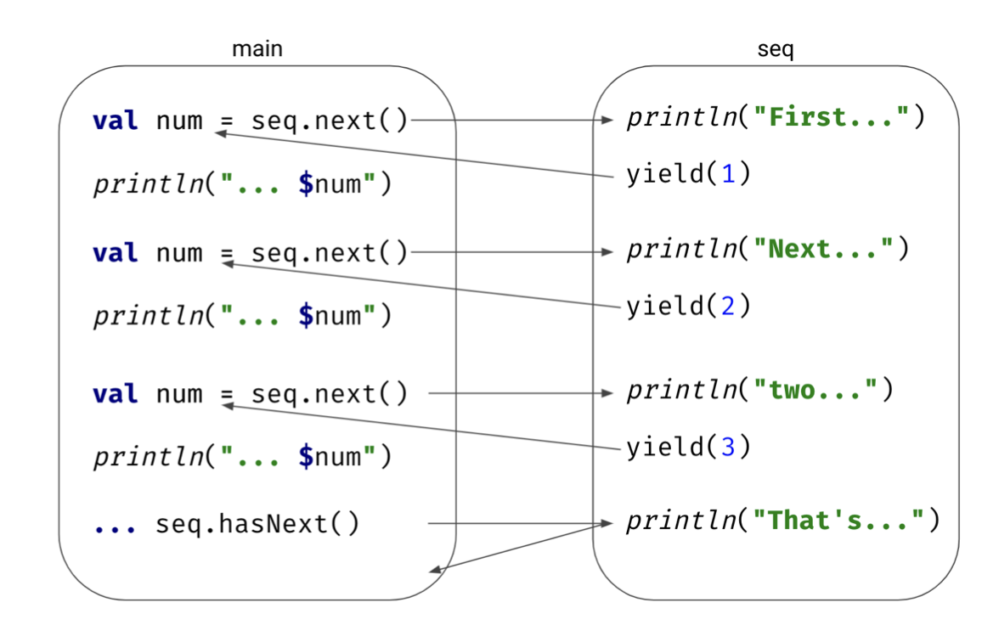

# 서론

Javascript나 Python 등과 같은 언어들에는 어떤 형태로든 coroutine을 사용한 구조를 볼 수 있다.

- Async - Await 구조
- Generator 함수

Kotlin은 **Sequence를 구현하기 위해 Generator 함수 대신 Sequence Builder를 제공**한다.

> 추후에 설명하겠지만, 코틀린은 더욱 강력한 개념인 Flow를 지원한다.

[Sequence 기초](../../../../kotlin/sequence.md)

`sequence`함수에 람다 표현식을 넣어서 사용할 수도 있는데, 람다 안쪽에서는 `yield()`함수를 호출할 수 있다.

``` kotlin
val seq = sequence {
    println("First Number Ready")
    yield(1)
    println("Second Number Ready")
    yield(2)
    println("Third Number Ready")
    yield(3)
}

fun main() {
    for (num in seq) {
        print(num)
    }
}
```

이렇게 하면 다음과 같이 출력된다.

```
First Number Ready
1
Second Number Ready
2
Third Number Ready
3
```

여기서 집중해야 할 점은 **값이 필요할 때 준비된다는 것**이다.



1. `seq.next()`가 호출되면 다음 `yield`까지 실행된다.
2. 첫 `yield`의 값이 반환된다.
3. `seq.next()`가 호출되면 **이전에 멈췄던 곳부터 다시 실행**된다.
4. 다음 `yield`의 값이 반환된다.

이렇듯 함수는 중간에 멈출 수 없고, 멈췄던 곳 부터 실행될 수 없기 때문에 이런 방식은 suspension 없이는 힘들다.

물론 Sequence를 위한 Thread를 만들어 관리한다면 가능하지만, Thread를 관리하는 것은 비싸기 때문에 좋은 방법은 아니다.

Coroutine을 이용하기 때문에 **빠르고, 간단하고, 자원을 거의 소모하지 않고 구현**할 수 있다.

> 여기서 Sequence는 람다 표현식을 파라미터로 넘기는 간단한 DSL이다.
>
> 파라미터에서 `yield()` 메소드를 호출하게 되면 `this.yield()`와 같다.
>
> 여기서 `this`는 `suspend SequenceScope<T>.() -> Unit`를 의미하는데, 이런 방식을 **수신 객체 지정 람다(Receiver)**라고 부른다.
>
> Receiver를 이용함으로써 **this 키워드를 생략**할 수 있게 된다.
>
> 앞으로 Koroutine에서 많이 사용하기 때문에 잘 알아두는게 좋다.

# 실생활에서의 사용

## 수학적인 수열

``` kotlin
val fibonacci: Sequence<BigInteger> = sequence {
    var first = 0.toBigInteger()
    var second = 1.toBigInteger()
    while (true) {
        yield(first) val temp = first first += second second = temp
    }
}

fun main() {
    print(fibonacci.take(10).toList())
}
// [0, 1, 1, 2, 3, 5, 8, 13, 21, 34]
```

## 랜덤 문자열

``` kotlin
fun randomNumbers(
    seed: Long = System.currentTimeMillis()
): Sequence<Int> = sequence {
    val random = Random(seed)
    while (true) {
        yield(random.nextInt())
    }
}

fun randomUniqueStrings(
    length: Int,
    seed: Long = System.currentTimeMillis()
): Sequence<String> = sequence {
	val random = Random(seed)
    val charPool = ('a'..'z') + ('A'..'Z') + ('0'..'9') while (true) {
        
        val randomString = (1..length)
        	.map { i -> random.nextInt(charPool.size) }
        	.map(charPool::get)
        	.joinToString("")
        
        yield(randomString)
    }
}.distinct()
```

<br>

sequence는 데이터를 fetch하는 등 **다른 목적을 위해 사용되면 안된다.**

만약 데이터를 가져올 때 사용해야 한다면 Flow를 이용하면 된다.

> 추후에 더 자세하게 설명한다.

Flow는 Sequence와 비슷하게 사용할 수 있지만 Coroutine의 다른 기능들도 지원한다.

``` kotlin
fun allUsersFlow(api: UserApi): Flow<User> =
	flow {
        var page = 0
        do {
            val users = api.takePage(page++) // suspending
            emitAll(users)
        } while (!users.isNullOrEmpty())
    }
```

