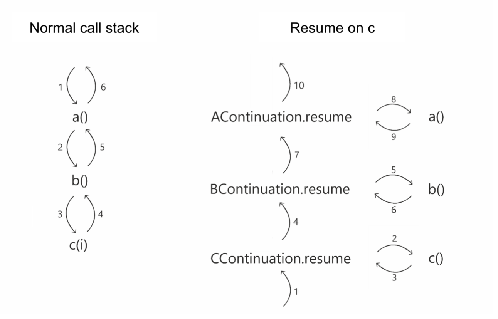
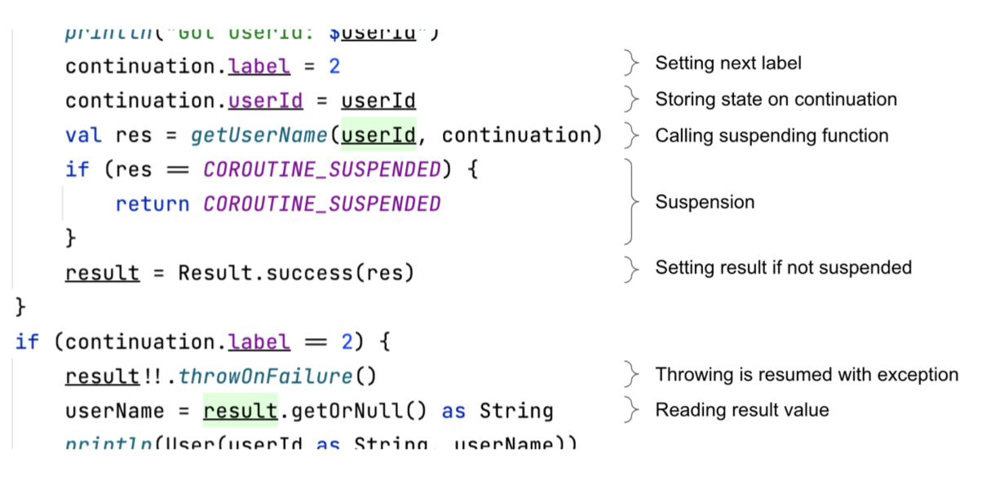

# 서론

자동차가 움직이는데, 자동차가 어떻게 움직이는지 알아야만 하는 부류의 사람들이 있다.

이번 챕터는 그런 사람들을 위한 챕터이기 때문에, 관심 없다면 스킵해도 된다.

# Continuation-passing Style

suspend 함수를 구현하는 방법에는 몇몇 방법이 있는데, 코틀린에서 선택한 방법은 Continuation Passing 방법이다.

Continuation Passing이란, **Continuation이 함수의 파라미터에서 파라미터로 넘기는 방법**을 말한다.

대표적으로, **컴파일 되었을 때 Continuation이 함수의 마지막 파라미터**로 생기게 된다.

``` kotlin
suspend fun getUser(): User?

suspend fun setUser(user: User)

suspend fun checkAvailability(flight: Flight): Boolean

// 컴파일 시
fun getUser(continuation: Continuation<*>): Any?

fun setUser(user: User, continuation: Continuation<*>): Any

fun checkAvailability(flight: Flight, continuation: Continuation<*>): Any
```

또한 **원래 선언했던 것과 반환 타입이 바뀐다는 것**을 알 수 있다.

이유는 Suspend된 함수는 우리가 원하는 타입을 반환하지 않고, 특별한 Marker인 `COROUTINE_SUSPENDED`를 반환할수도 있다.

나중에 자세히 알아볼 예정이기 때문에 지금은 그냥 `getUser()`가 `User?` 또는 `COROUTINE_SUSPENDED`를 반환할 수 있다는것만 알아두면 된다.

## 간단한 예제

더 깊게 알아보기 전에, 간단한 함수로 시작해 보자.

``` kotlin
suspend fun myFunction() {
    println("Before")
    delay(1000) // suspending
    println("After")
}
```

이제 저 함수는 컴파일 시 다음과 같이 바뀌게 된다.

``` kotlin
fun myFunction(continuation: Continuation<*>): Any
```

다음으로, 이 함수는 상태를 저장하기 위한 이 함수만의  Continuation 객체가 필요하다.

설명의 편의를 위해 그 객체를 `MyFunctionContinuation`라는 이름이라고 가정하자.

메소드 Body의 첫 부분에 `myFunction`은 `continuation`을 `MyFunctionContinuation`으로 Wrapping되어 있을 것이다.

``` kotlin
val continuation = MyFunctionContinuation(continuation)
```

만약 continuation이 이미 wrapping되어있다면, 객체가 변형되면 안되기 때문에 그대로 반환해야 한다.

``` kotlin
val continuation =
	continuation as? MyFunctionContinuation
	?: MyFunctionContinuation(continuation)
```

> label이 변경되고, 이걸 확인하는 로직이 있기 때문에 메커니즘은 이것보다 더 복잡하다.

<br>

아까 봤던 함수를 다시 보자.

``` kotlin
suspend fun myFunction() {
    println("Before")
    delay(1000) // suspending
    println("After")
}
```

이 함수는 두 가지 경우로 나뉠 수 있다.

- 처음 실행되는 경우
- 메소드가 suspend 된 이후 재시작되는 경우

메소드가 언제 정지되었는지 식별하기 위해 **`label`이라는 필드가 있다.**

1. `label`이 0으로  초기화된다.
2. `label`이 0이기 때문에 메소드의 처음부터 실행되게 된다.
3. `label`을 다음 값으로 바꿔준다.
4. 메소드가 suspend된다.

따라서 위 메소드는 간단히 다음과 같이 볼수도 있다.

``` kotlin
fun myFunction(continuation: Continuation<Unit>): Any {
    val continuation = continuation as? MyFunctionContinuation
    	?: MyFunctionContinuation(continuation)
    
    if (continuation.label == 0) {
        println("Before")
        continuation.label = 1
        if (delay(1000, continuation) == COROUTINE_SUSPENDED) {
            return COROUTINE_SUSPENDED
        }
    }
    
    if (continuation.label == 1) {
        println("After")
        return Unit
    }
    
    error("Impossible")
}
```

1. Continuation 객체가 `MyFunctionContinuation`으로 Wrapping된다.
2. `label`이 처음에는 0이기 때문에 if문을 들어간다.
3. Before를 출력한다.
4. `label`을 다음 숫자(1)로 바꿔준다.
5. `delay()`가 실행된다. `delay()`가 `COROUTINE_SUSPENDED`를 반환하면 이 함수도 `COROUTINE_SUSPENDED`를 반환하게 된다.
6. 이 함수를 호출한 함수 또한 만약 suspend 함수를 호출했다면, `COROUTINE_SUSPENDED`를 계속해서 반환해서 메소드 호출 Stack의 최상위까지 올라간다.

이렇게 **모든 함수에서 return(종료)시켜줌으로써 Thread를 다른 곳에서 사용할 수 있도록 해준다.**

<br>

여기서 궁금한게 생길 수 있는데, 만약 `delay()`가 `COROUTINE_SUSPENDED`를 반환하지 않으면 어떻게 될까?

> 그럴 일은 없겠지만, 단순히 예를 들어보자.

만약 `delay()`에서 `Unit`을 반환하게 되면 그냥 다음으로 넘어가게 된다.

반전 없이, if문에 들어가지 못했으니 다음으로 넘어갈 뿐이다.

<br>

이제, Continuation에 대해 알아보자.

Continuation은 **anonymous class의 구현체**로, 간단하게 보면 다음과 같다.

``` kotlin
cont = object : ContinuationImpl(continuation) {
    var result: Any? = null
    var label = 0
    
    override fun invokeSuspend(`$result`: Any?): Any? {
        this.result = `$result`
        return myFunction(this)
    }
}
```

> 실제로는 위와 같은 클래스명은 아니지만, 알아보기 쉽게 하기 위해서 임의로 작성한 것이다.
>
> 또한 중요한 점만 짚고 넘어가기 위해 최적화나 기능들을 최대한 배제한 것이다.

<br>

>여기서 `Continuation`의 타입 파라미터는 JVM에서 컴파일될 때 사라진다.
>
>JVM Bytecode를 decompile한 코드이기 때문에 타입 파라미터에 대해 걱정하지 않아도 된다.

<br>

`myFunction()`의 전체적인 구현체를 보면 다음과 같다.

``` kotlin
fun myFunction(continuation: Continuation<Unit>): Any {
    val continuation = continuation as? MyFunctionContinuation
        ?: MyFunctionContinuation(continuation)
    
    if (continuation.label == 0) {
        println("Before")
        continuation.label = 1
        
        if (delay(1000, continuation) == COROUTINE_SUSPENDED){
            return COROUTINE_SUSPENDED
        }
    }
    
    if (continuation.label == 1) {
        println("After")
        return Unit
    }
    error("Impossible")
}

class MyFunctionContinuation(
    val completion: Continuation<Unit>
) : Continuation<Unit> {
    override val context: CoroutineContext
    	get() = completion.context var label = 0
    
    var label = 0
    var result: Result<Any>? = null var userId: String? = null
    
    override fun resumeWith(result: Result<String>) {
        this.result = result
        val res = try {
            val r = myFunction(token, this)
            
            if (r == COROUTINE_SUSPENDED) {
            	return Result.success(r as Unit)
            }
        } catch (e: Throwable) {
            Result.failure(e)
        }
        completion.resumeWith(res)
    }
}
```

## 상태를 가진 함수

만약 함수 중에 변수에 담긴 값이 있는데, 그 상태에서 suspend되면 어떻게 할까?

state는 suspend된 이후에도 유지되어야 하기 때문에 Continuation에 저장되어야 한다.

다음 함수를 보자.

``` kotlin
suspend fun myFunction() {
    println("Before")
    var counter = 0
    delay(1000) // suspending
    counter++
    println("Counter: $counter")
    println("After")
}
```

counter에는 두 개의 label(0과 1)에서 필요하다.

따라서 이 정보를 Continuation에서 저장해 두어야 하는데, **suspension 직전에 저장**된다.

또한 이 정보들을 **함수가 호출되자마자 복원**된다.

<br>

따라서 실제 클래스는 다음과 같이 바뀐다.

``` kotlin
fun myFunction(continuation: Continuation<Unit>): Any {
    val continuation = continuation as? MyFunctionContinuation
        ?: MyFunctionContinuation(continuation)
    
    var counter = continuation.counter
    if (continuation.label == 0) {
        println("Before")
        counter = 0
        continuation.counter = counter
        continuation.label = 1
        
        if (delay(1000, continuation) == COROUTINE_SUSPENDED){
            return COROUTINE_SUSPENDED
        }
    }
    
    if (continuation.label == 1) {
        counter = (counter as Int) + 1
        println("Counter: $counter")
        println("After")
        return Unit
    }
    error("Impossible")
}

class MyFunctionContinuation(
    val completion: Continuation<Unit>
) : Continuation<Unit> {
    override val context: CoroutineContext
    	get() = completion.context
    
    var label = 0
    var counter = 0
    
    override fun resumeWith(result: Result<String>) {
        this.result = result
        val res = try {
            val r = myFunction(token, this)
            if (r == COROUTINE_SUSPENDED)
            	return Result.success(r as Unit)
        } catch (e: Throwable) {
            Result.failure(e)
        }
        completion.resumeWith(res)
    }
}
```

위에서 볼 수 있다싶이 MyFunctionContinuation 객체 내부에 counter 라는 변수가 추가된다.

## 반환 값이 있는 suspend 함수

우선 예제로 다음 함수를 보자.

``` kotlin
suspend fun printUser(token: String) {
    // state 0
    println("Before")
    val userId = getUserId(token)
    
    // state 1
    println("Got userId: $userId")
    val userName = getUserName(userId, token) // suspending
    
    // state 2
    println(User(userId, userName))
    println("After")
}
```

여기서 suspend 함수는 `getUserId()`와 `getUserName() `두 개가 있다.

파라미터로 token을 받아오고, suspend 함수의 반환 값을 사용한다.

<br>

다음과 같은 값 들을 Continuation에 저장해 주어야 한다.

- 토큰은 state 0과 1에서 사용되기 때문에 저장되어야 한다.

- userId는 state 1과 2에서 사용되기 때문에 저장되어야 한다.

- suspend 함수의 결과가 필요하기 때문에 `Result`타입의 변수가 필요하다.

  만약 함수가 성공적으로 실행되었다면 `Result.Success(value)`가, 실패했다면 `Result.Failure(exception)`이 저장된다.

따라서 Continuation은 다음과 같은 형태가 된다.

``` kotlin
// continuation이 함수의 마지막 파라미터로 생긴다.
fun printUser(token: String, continuation: Continuation<*>): Any {
    // 만약 처음 실행된거라면 전용 Continuation 객체를 생성하고, 아니라면 PrintUserContinuation으로 형변환을 시켜준다.
    val continuation = continuation as? PrintUserContinuation
    	?: PrintUserContinuation(continuation as Continuation<Unit>, token)
    
    // continuation에서 변수를 설정한다.
    var result: Result<Any>? = continuation.result
    var userId: String? = continuation.userId
    val userName: String
    
    // state 0
    if (continuation.label == 0) {
        println("Before")
        continuation.label = 1
        val res = getUserId(token, continuation)
        
        if (res == COROUTINE_SUSPENDED) {
            return COROUTINE_SUSPENDED
        }
        
        result = Result.success(res)
    }
    
    // state 1
    if (continuation.label == 1) {
        userId = result!!.getOrThrow() as String
        println("Got userId: $userId")
        continuation.label = 2
        continuation.userId = userId

        // 다른 suspend함수로부터 result를 받아온다.
        val res = getUserName(userId, continuation)
        
        if (res == COROUTINE_SUSPENDED) {
            return COROUTINE_SUSPENDED
        }
        
        // res
        result = Result.success(res)
    }
    
    // state 2
    if (continuation.label == 2) {
        userName = result!!.getOrThrow() as String
        println(User(userId as String, userName))
        println("After")
        return Unit
    }
    error("Impossible")
}

class PrintUserContinuation(
    val completion: Continuation<Unit>,
    val token: String
) : Continuation<String> {
    override val context: CoroutineContext
    	get() = completion.context    
    var label = 0
    var result: Result<Any>? = null
    var userId: String? = null
    
    override fun resumeWith(result: Result<String>) {
        this.result = result
        val res = try {
            val r = printUser(token, this)
            if (r == COROUTINE_SUSPENDED)
            	return Result.success(r as Unit)
        } catch (e: Throwable) {
            Result.failure(e)
        }
        completion.resumeWith(res)
    }
}
```

## Call Stack

a함수가 b 함수를 호출했을 때, Virtual Machine은 a의 상태와, b 함수가 끝났을 때 돌아갈 곳을 저장해 두어야 한다.

이러한 **정보들을 저장하고 있는 자료구조를 Call Stack**이라고 부른다.

여기서 문제는 suspend되었을 때 Call Stack을 모두 pop시키기 때문에 **Call Stack은 `resume()`될 때 필요없다.**

그 대신, **Continuation이 Call Stack을 제공한다.**

각각의 Continuation은 다음과 같은 정보들을 저장해 준다.

- 함수에서 사용되는 변수 / 파라미터

- 어디서 suspend 되었는지

- 자신을 호출한 Continuation의 참조 값.

  쉽게 말하면 `continuation.continuation.continuation.continuation`과 같은 방식으로 Call Stack을 대체해 준다.

결과적으로 Continuation은 일반적은 Call Stack에서 제공하는 정보들을 모두 담고있게 된다.

<br>

이제 예제를 보자

``` kotlin
suspend fun a() {
    val user = readUser()
    b()
    b()
    b()
    println(user)
}

suspend fun b() {
    for (i in 1..10) {
        c(i)
    }
}

suspend fun c(i: Int) {
    delay(i * 100L)
    println("Tick")
}
```

Continuation을 디버깅 하면 다음과 같이 나오게 된다.

``` kotlin
CContinuation(
   label = 1,
   completion = BContinuation(
       i = 4,
       label = 1,
       completion = AContinuation(
           label = 2,
           user = User@1234,
           completion = ...
       )
   )
)
```

1. Continuation이 재실행 된다.
2. Continuation은 자신의 함수를 실행한다.
3. 자신을 호출한 Continuation의 함수를 호출한다.
4. stack 맨 위로 올라갈때까지 반복된다.



1. CContinuation이 resume된다.
2. `c()`함수가 실행된다.
3. `c()`함수의 결과가 반환된다.
4. BContinuation이 resume된다.
5. `b()`함수가 실행된다.
6. `b()`함수의 결과가 반환된다.
7. Call Stack의 끝까지 반복된다.

``` kotlin
override fun resumeWith(result: Result<String>) {
    this.result = result
    val res = try {
        val r = printUser(token, this)
        if (r == COROUTINE_SUSPENDED)
        	return Result.success(r as Unit)
    } catch (e: Throwable) {
        Result.failure(e)
    }
    completion.resumeWith(res)
}
```

exception도 비슷하다.

잡히지 않은 예외는 `resumeWith()`에서 잡히게 되고, `Result.failure()`로 wrapping하게 된다.

<br>

이번 챕터를 한 화면에서 정의하면 다음과 같다.



## 실제 코드

실제 Continuation과 suspend 함수는 다음과 같은 내용들을 포함하고 있기 때문에 더 복잡하다.

- 더 나은 ExceptionStackTrace 구축

- coroutine suspension interceptor 추가

- 꼬리물기 최적화나 변수 최적화

  > 꼬리물기 최적화란 재귀함수와 같은 경우에 **호출한 곳으로 되돌아갈 필요를 없게하여 Call Stack을 최적화 하는 방법**이다.
  >
  > 기존의 Call Stack에는 메소드를 호출한 곳이 어디인지 저장되었는데, 그것을 절약할 수 있게 된다.

<br>

아래 코드는 코틀린 1.5.31의 BaseContinuationImpl의 일부분을 발췌한 것이다.

``` kotlin
@SinceKotlin("1.3")
internal abstract class BaseContinuationImpl(
    public val completion: Continuation<Any?>?
) : Continuation<Any?>, CoroutineStackFrame, Serializable {
    
    public final override fun resumeWith(result: Result<Any?>) {
        // 이 반복문은 StackTrace를 더 온전하고 짧게 호출하기 위해서 재귀호출을 풀어낸다
        var current = this
        var param = result
        while (true) {
            // 정확히 어떤 suspend Call Stack들이 실행되었는지 디버깅 라이브러리가 위해
            // resume된 모든 Continuation에 대해 probeCoroutineResumed()를 실행한다.
            probeCoroutineResumed(current)
            with(current) {
                val completion = completion!! // completion 없이 실행시키려 하면 빠르게 실패를 띄워버린다.
                val outcome: Result<Any?> =
                    try {
                        val outcome = invokeSuspend(param)
                        if (outcome === COROUTINE_SUSPENDED) return
                        Result.success(outcome)
                    } catch (exception: Throwable) {
                        Result.failure(exception)
                    }
                releaseIntercepted() // state machine이 종료된다.
                if (completion is BaseContinuationImpl) {
                    // 반목문을 통해 재귀를 취소한다.
                    current = completion
                    param = outcome
                } else {
                    // CallStack 끝에 도달했다면 실행한 후 종료한다.
                    completion.resumeWith(outcome)
                    return
                }
            }
        }
    }
```
