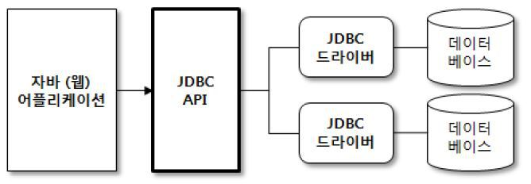
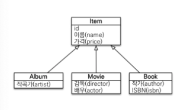
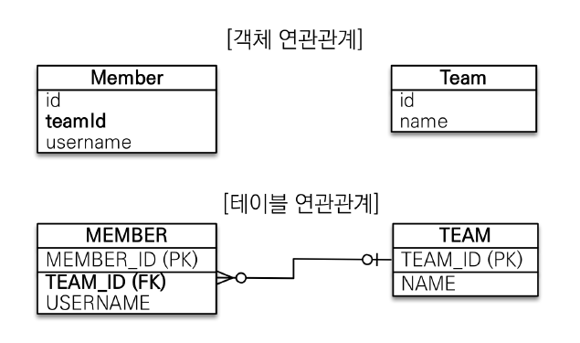
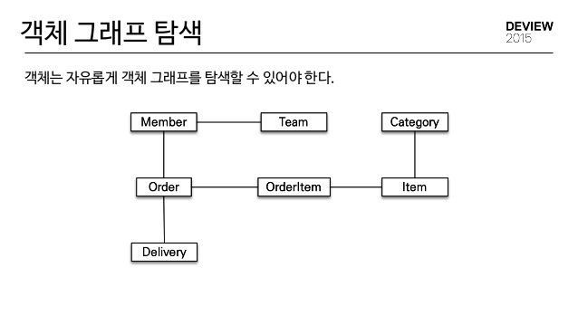

# 챕터1 JPA 소개

### JPA가 없는 SQL

데이터베이스에 데이터를 관리하려면 SQL을 사용해야 한다.

자바로 작성한 애플리케이션은 **JDBC API**를 사용해서 SQL을 전달하게 된다.

##### JDBC란

JDBC API란 Java Database Connectivity의 약자로, 자바에서 DB에 접속하도록 돕는다.



즉, JPA 또한 JDBC를 이용하며, 자바의 모든 Database에 access하는 기술의 근간이다.


우리가 JPA를 사용한다고 해서 JDBC를 사용하지 않는것은 아니다.

또한, JPA와 같은 Database에 Access 하는 기술은 Mybatis 등 여러가지가 있다.

> 기존의 서버 개발자들은 매우 당연하다 생각하였고, 모두 SQL을 다룰줄 안다.
>
> 물론 JPA를 사용한다고 해서 SQL을 몰라도 되는것은 아니다. 오히려 더 깊숙히 알고있어야 한다.

> 우리가 JPA를 이용하고 있지만, JPA는 복잡한 쿼리 보다는 실시간 처리용 쿼리에 더 가깝다.
>
> 그렇기 때문에, 복잡한 쿼리를 이용하고 싶다면 JPA의 @Query 어노테이션을 통해 직접적인 쿼리를 작성하거나, 다른 프레임워크를 이용하는 것도 좋다.

### JPA 없이 회원 엔티티 개발

우리는 JPA가 없다면, 회원 조회용 SQL문을 작성하고, sql문의 값에 동적으로 값을 넣어주고, 해당 결과를 **직접** 매핑시켜주어야 한다.

이렇게 하면 우리는 회원 조회용 API를 완성할 수 있다.

> 하지만 이렇게 만들어진 API는 가독성이 좋지 않고, JAVA - SQL - JAVA 와 같이 JAVA 코딩을 하던 도중, SQL을 사용하도록 머리를 바꿔야 한다.
>
> 또한 이렇게 짜여진 코드들은 실제 API가 호출되기 전엔 쿼리가 실질적으로 작동하는지 확인하기 어렵다.

이렇게 긴 과정을 거쳐 회원 조회 SQL을 작성했다.

하지만, 이렇게 힘든 과정을 계속해서 반복한다면 지루하고 재미없는 코딩만 계속될 것이다.

또한 만약 비지니스 로직이 수정된다면, 우리는 SQL문들을 하나하나 찾아가며 추가/삭제 작업을 해줘야 한다.

게다가 이렇게 하나하나 수정한다 하더라도, 모두 수작업이기 때문에 **오류가 발생할 확률**이 높다.

### JPA를 통한 문제 해결

##### 저장

jpa에서 저장 기능은 단순히 아래와 같은 메소드를 호출해서 만들 수 있다.

``` java
jpa.persist(객체);
```

##### 조회

JPA에서 조회는 아래와 같이 훨씬 간편해 졌다.

``` java
객체 객체 = jpa.find(매핑시킬 클래스, 검색어);
```

DAO에 매핑시킬 필요도 없고, 굳이 쿼리를 작성하지 않아도 된다.

##### 수정

jpa에서 수정은 아래와 같이 할 수 있다.

단순히 객체를 조회하고, 해당 객체의 값을 수정함으로써 수정이 완료된다.

> 하지만 객체를 수정했음에도 DB에 저장하는 persist() 메소드는 호출하지 않았다.
>
> 이것에 관해서는 3장에서 설명하게 된다.

``` java
Member member = jpa.find(Member.class, memberId);
member.setName("이름2");
```

##### 연관된 객체 조회

우선 DAO에 다음과 같이 연관된 객체를 추가해 준다.

``` java
class Member {
    .
    .
    .
    private Team team;
}
```

> Team에는 무엇이 들어오든 상관 없다.

이렇게 Team 이라는 객체를 만들어 준 후에 member를 조회해 준다.

``` java
Member member = jpa.find(Member.class, memberId);
```

그 후에, 객체.get연관객체 처럼 사용하면 연관객체를 조회할 수 있다.

``` java
Team team = member.getTeam();
```

> 이렇게 사용하는 방식은 List의 경우에도 가능하다. 

### 패러다임 불일치

#### 패러다임 불일치란?

객체와 관계형 데이터베이스는 서로 지향하는 목적이 다르기 때문에, 기능과 표현 방법도 다르다.

이렇게 객체와 관계형 데이터베이스 간의 차이처럼, 여러가지 **지향하는 목적이 다름에 따라 생기는 문제점**을 패러다임 불일치 라고 한다.

#### JPA를 통한 패러다임 불일치 해결

##### 상속

객체는 **상속** 이라는 기능을 지원하지만, 테이블은 상속이란게 없다.

> 일부 DB는 지원하지만, 객체의 상속과는 다르다.

데이터베이스 모델링에서 이야기하는 슈퍼타입 - 서브타입을 이용하면 객체의 상속과 유사한 형태로 테이블을 설계할 수 있다.



위와 같은 형태의 테이블은 아래와 같은 객체로 구현할 수 있다.

``` java
abstract class Item {
    Long id;
    String name;
    int price;
}

class Album extends Item {
    String artist;
}

class Movie extends Item {
    String director;
    String actor;
}

class Book extends Item {
    String author;
    String isbn;
}
```

이렇게 객체를 생성했다면, Album 객체와 Item 객체 모두 INSERT 문을 작성해야 한다.

또한, JDBC를 이용해서 쿼리를 작성하게 되면, 여러가지 복잡하고 긴 쿼리를 작성해야 한다.

> 만약, 자바 컬렉션을 사용하고 있다면 패러다임 불일치를 걱정할 필요 없다.

##### JPA의 상속

JPA는 위에서 발생했던 패러다임의 불일치를 개발자 대신 해결해 준다.

개발자는 단지 컬렉션에 객체를 넣듯이, JPA에 객체를 저장하면 JPA는 알아서 패러다임 불일치를 해결하고 우리가 원하는 형태로 값을 저장해 준다.

위에서 만들어진 객체에서 .persist() 메소드를 통해 저장하게 되면, 알아서 쿼리를 두 테이블에 나누어서 저장한다.

``` java
Album album = jpa.find(Album.class, albumId);
```

find 명령어를 작성하면 알아서 두 테이블을 조인해서 SELECT 문을 작성해 준다.

``` mysql
SELECT I.*, A.* FRO ITEM I
    JOIN ALBUM A ON I.ITEM_ID = A.ITEM_ID
```

#### 연관 관계

- 객체

  객체는 참조를 통해 다른 객체와 연관 관계를 가지게 된다.

  또한 객체는 참조에 접근해서 다른 해당 객체를 조회하는 방향으로 사용된다.

- 테이블

  테이블은 외래 키를 통해 다른 테이블들과 연관을 맺고, Join을 통해 연관된 테이블을 조회한다.



> 연관 관계로 인해서 생기는 패러다임 불일치는 굉장히 복잡하고, 고치기 어렵다.

- Member 객체

  Member 객체는 Member의 team 필드에, Team 필드 객체의 참조를 보관해서 관계를 맺는다.

  > 이 참조 필드에 접근하면 Member과 연관된 Member에 연관된 객체에 접근할 수 있다.

- Member 테이블

  Member 테이블은 team_id 라는 외래 키 컬럼을 통해 member 테이블과 team 테이블의 관계를 맺는다.

  team_id(외래 키 컬럼) 를 통해 다른 team 테이블을 조회할 수 있다.

  > join을 사용하는 방법과 서브쿼리를 이용하는 방법이 있다.

- 문제점

  Member 객체에서 teamId 라는 fk 객체를 그대로 저장할 수 있다.

  하지만, 그렇게 된다면 member.getTeamId 를 했을 때 그저 Long 타입의 id 값만 오게 될 것이다.

- SQL을 통한 해결

  기본적으로 자바 객체에서는 테이블의 FK를 그대로 저장하는것이 아니라, 객체의 참조 그 자체를 저장해야 한다.

  즉, teamId가 아닌 team 객체 자체를 저장해야 한다.

``` java
class Member {
    
    String id;
    
    Team team;
    
    String username;
}
```

- 이러한 방식을 사용했을 때 문제점

  우리가 객체 자체를 저장하기 때문에, 저장과 조회를 할 때 문제가 발생한다.

  - 저장

    객체를 데이터베이스에 저장할 수 없기 때문에, 객체가 아니라 id를 저장해 줘야 한다.

    우리는 team 이라는 객체 대신 team.getId를 통해 해당 team의 id 값을 저장하면 된다.

  - 조회

    조회할 때에는 member를 조회한 후에, team을 조회하고 memer.setTeam() 메소드를 통해 member의 team을 원하는 team으로 바꾼 후에 반환한다.

    > 이러한 행동은 패러다임 불일치를 해결하기 위함이다.
    >
    > 그러므로, 컬렉션에 저장한다면 필요 없는 일이다.

- JPA를 통한 해결

  JPA는 기본적으로 연관관계에 대한 패러다임 불일치 문제를 해결해 준다.

  - 저장

    ``` java
    member.setTeam(team);
    jpa.persist(member);
    ```

    JPA는 team 이라는 연관관계를 INSERT에 넣으면 알아서 teamId로 변환해서 넣어준다.

  - 조회

    ``` java
    Member member = jpa.find(Member.class, memberId);
    Team team = member.getTeam();
    ```

    위와 같이, JPA는 알아서 member의 teamId를 team 객체로 찾아서 반환해 준다.

#### 참조의 방향

- 객체

  기본적으로 객체는 참조가 있는 방향으로만 접근할 수 있다.

  여기서는 member 객체가 team 객체로만 접근할 수 있다.

- 테이블

  테이블은 참조에 방향이 없다.

  즉, member 테이블을 통해 team 테이블을 접근할 수 있고, team 테이블을 통해 member 테이블에 접근할 수 있다.

#### 객체 그래프 탐색

> 객체 그래프 탐색이란, 참조를 통해서 연관된 다른 객체를 찾는 것이다.



이렇게 되어 있는 객체 그래프에서 우리는 하나의 객체만 가지고 다른 객체들을 쭈욱 탐색할 수 있어야 한다.

> member.getOrder().getOrderItem().getItem()....

객체 그래프를 사용해야 하는데, 만약 SQL로 해당 객체를 조회했다면 객체 그래프 탐색에 제약이 생기게 된다.

> JOIN을 통해 조회한 테이블만 객체 그래프 탐색처럼 작동할 수 있다.

> 만약 JOIN을 하지 않았다면 해당 객체는 null 값이 들어가게 된다.

이렇게 객체 그래프 탐색에 제약이 생기는건 개발자에게 큰 문제로 작용하고, 객체 그래프 탐색이 가능한지 여부를 판단하기 위해서는 DAO를 열어야 한다.

하지만 이렇게 SQL에 의존적인 개발은 별로 좋은 개발이 아니다.

#### JPA에서 객체 그래프의 탐색

> 결론
>
> JPA는 객체 그래프 탐색이 자유롭다.

JPA는 지연 로딩 이라는 방법을 이용한다.

> 지연 로딩이란, 실제 객체를 사용하는 시점까지 DB 조회를 미루기 때문에 지연 로딩이다.
>
> LAZY 라고도 한다.

JPA는 이러한 지연 로딩 방식을 투명하게, 즉 알아서 처리해 준다.

아래의 코드는 지연 로딩을 사용한 코드이다.

``` java
class Member {
    private Order order;
    
    public Order getOrder() {
        return order;
    }
}

class Main {
    .
    .
    .
    .
    Member member = jpa.find(Member.class, memberId);
    Order order = member.getOrder();
    order.getOrderDate();
}
```

위 코드에서 ORDER에 관한 SELECT 문이 발생하는 것은 jpa.find도 아니고, member.getOrder도 아니다.

order 객체를 만든 후에, 해당 객체를 실질적으로 사용할 때 DB를 조회한다.

> 즉, order.getOrderDate() 메소드를 실행할 때 이다.

#### 비교

- 데이터베이스

  데이터베이스는 PK의 값으로 로우를 비교한다.

- 객체

  객체는 동일성(주소)과 동등성(실제 내용)을 통해 비교한다.

여기서 발생하는 패러다임 불일치는 JPA가 해결해 준다.

JPA는 같은 트랜잭션일 경우, 같은 객체가 조회되는 것을 보장한다.

> 즉, == 연산자를 통해 비교가 가능하다.

### JPA 설명

#### ORM

ORM이란 Object-Relational Mapping의 약자로, 객체와 관계형 데이터베이스를 매핑시켜주는 녀석이다.

ORM 프레임워크는 객체와 테이블을 매핑시켜 주어서 패러다임 불일치 문제를 개발자 대신 해결시켜준다.

우리는 그저 자바 컬렉션에 저장하듯이 ORM 프레임워크에 저장하게 되면, 알아서 ORM 프레임워크가 쿼리를 작성해 준다.

또한, 어떻게 매핑시켜주어야 하는지만 알려준다면 관계형 데이터베이스를 간편하게 이용할 수 있다.

#### JPA의 동작


JPA에서의 저장은 위 그림과 같이 DAO 객체에서 PERSIST를 하게 되면, 아래의 과정을 거친다.

1. JAVA 객체와 함께 persist() 메소드를 실행한다.
2. Entity 분석
3. INSERT SQL 쿼리 생성
4. JDBC API를 통해 객체를 저장해 준다.
5. 그 후에 패러다임 불일치 문제를 해결해 준다.


JPA에서 find를 사용할때 또한 다음과 같은 과정을 거친다.

1. find 메소드를 호출한다.
2. SELECT 쿼리를 생성한다.
3. JDBC API를 통해 SELECT 결과를 받아온다.
4. ResultSet 객체에 결과를 매핑시켜 준다.
5. 패러다임 불일치를 해결시켜 준다.
6. Entity Object를 DAO에 반환시켜 준다.

### JPA를 사용해야 하는 이유

- 생산성

  JPA를 사용하면 객체 설계 중심으로 생각할 수 있다.

  또한 SQL을 개발자가 직접 작성하지 않아도 된다.

- 유지보수

  기존의 SQL을 사용했다면, Entity를 수정하고 싶을 때 모든 JDBC API 코드를 수정해야 한다.

  하지만, JPA를 사용한다면 단순히 Entity를 수정하면 모두 수정할 수 있다.

- 패러다임 불일치 해결

  JPA를 통해 상속, 객체 그래프 등을 해결할 수 있다.

- 성능

  JPA는 애플리케이션과 데이터베이스 사이에서 성능 최적화 기능을 제공한다.

  > 원래 한 트랜잭션에서 SELECT 문을 2번 요청해야 했을 때, JPA는 처음에만 SELECT 문을 실행하고, 2번째 이후부터는 조회된 회원 객체를 이용할 수 있다.

- 벤더 독립성

  관계형 데이터베이스는 같은 기능이라도, 다른 데이터베이스 이면 사용법이 다를 수 있다.

  이런 상황에서 만약 데이터베이스를 수정하고 싶다면 모든 SQL문을 수정해야 한다.

  하지만 JPA는 애플리케이션과 데이터베이스 간의 추상화된 인터페이스를 지원하기 때문에, 특정 데이터베이스에 종속되지 않을 수 있다.

  > 단순히 JPA에게 다른 데이터베이스를 사용한다고 알리기만 하면 데이터베이스를 바꿀 수 있기 때문에, 실제로 개발에서는 H2 라는 데이터베이스를 사용하고 실제 서비스 되는 환경은 다른 데이터베이스를 이용하기도 한다.

- 표준

  JPA는 자바의 표준 ORM이기 때문에, 다른 구현 기술로 바꾸기 간편하다.

  > 다른 라이브러리를 사용하기 쉽다.