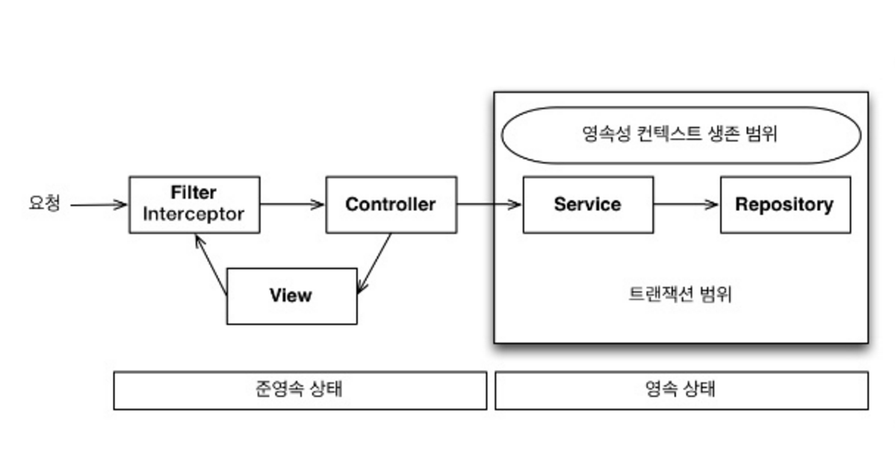
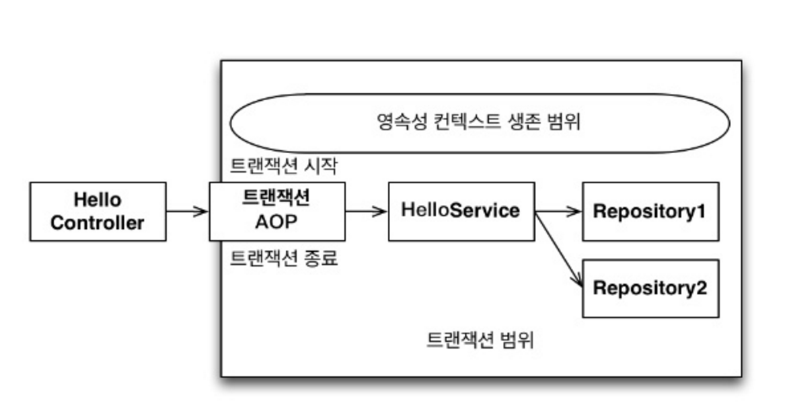
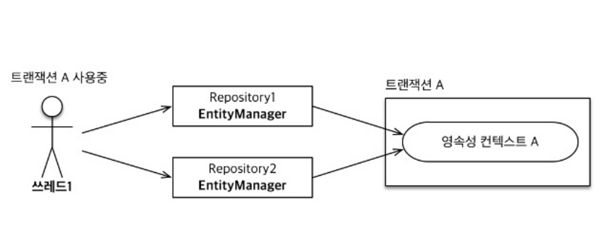
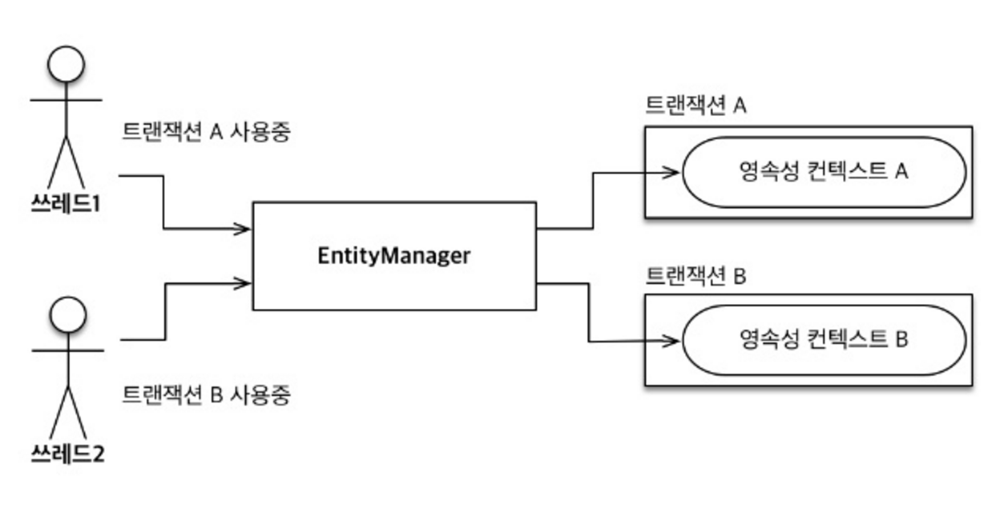
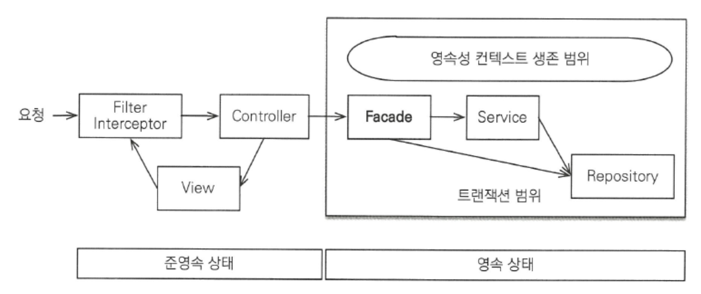
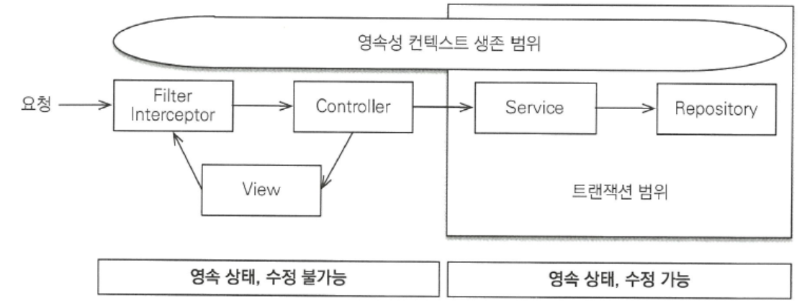

# 챕터 13 웹 애플리케이션과 영속성 관리

순수한 자바 환경에서 JPA는 개발자가 직접 엔티티 매니저를 생성해 주어야 하고, 트랜잭션도 관리해야 한다.

하지만 Spring에선 컨테이너의 전략을 따라야 한다.

## Spring Container의 기본 전략

Spring Container는 영속성 컨텍스트의 생존 범위를 트랜잭션 범위와 동일하게 하는 전략을 기본으로 사용한다.



Spring에선 보통 Service에 `@Transactional` 어노테이션을 붙여서 트랜잭션을 시작한다.

외부에선 단순히 서비스의 메소드를 호출하는 것처럼 보이지만, `@Transactional` 어노테이션이 있으면 메소드 실행 전 트랜잭션 AOP가 동작한다.

 

위 그림과 같이 컨트롤러가 서비스를 호출하기 직전에 AOP가 동작해서 트랜잭션이 시작되고, 무사히 서비스가 끝났다면 트랜잭션을 종료해 준다.

물론 트랜잭션 종료 직전에는 flush동작을 수행하며, Runtime Exception이 발생하면 롤백하고 flush 없이 종료한다.

<br>

일반적인 상황에서는 다음과 같은 흐름을 따른다.

1. `@Transactional`을 붙여줬기 때문에 트랜잭션 AOP가 동작해서 트랜잭션이 시작된다.
2. Repository.find() 메소드로 엔티티를 조회한다.(영속 상태)
3. `@Transactional` 어노테이션이 붙은 메소드가 정상적으로 종료되면 트랜잭션 AOP가 동작해 flush 시킨 후 트랜잭션을 종료시킨다. 이제 모든 엔티티는 준영속 상태가 된다.
4. Controller에 반환된 엔티티는 준영속 상태이다.

트랜잭션 범위의 영속성 컨텍스트를 조금 더 자세히 살펴보자

### 트랜잭션이 같으면 같은 영속성 컨텍스트를 사용한다.



트랜잭션 범위의 영속성 컨텍스트 전략에서 어디서 엔티티 매니저를 사용하던간에 같은 트랜잭션이라면 같은 영속성 컨텍스트를 사용하게 된다.

즉 엔티티 매니저가 여러개여도 하나의 영속성 컨텍스트를 사용할 수 있다.

### 트랜잭션이 다르면 다른 영속성 컨텍스트를 사용한다.



위 그림과 같이 여러 쓰레드에서 하나의 엔티티 매니저를 사용하더라도 다른 트랜잭션이면 각각의 영속성 컨텍스트를 사용하게 된다.

## 준영속 상태와 LAZY 로딩

아까 전 그림처럼 스프링은 트랜잭션 범위의 영속성 컨텍스트 전략을 기본으로 사용한다.

그리고 트랜잭션은 보통 서비스 계층에서 시작되기 때문에 서비스가 끝나는 시점에 트랜잭션과 영속성 컨텍스트도 종료되게 된다.

따라서 **컨트롤러나 뷰와 같은 계층에선 엔티티가 준영속 상태가 된다.**

<br>

이해하기 쉽도록 다음 예제를 보자

``` java
@Entity
public class Order {
    
    @Id @GeneratedValue
    private Long id;
    
    @ManyToOne(fetch = FetchType.LAZY)
    private Member member;
    
}
```

만약 서비스에서 위 Order를 조회하고, 반환했다고 가정하자.

그렇다면 컨트롤러에서 Order는 준영속 상태이다.

따라서 만약 Controller에서 `order.getMember()`와 같이 LAZY 로딩을 호출하게 되면 예외가 발생하게 된다.

## 준영속 상태와 변경 감지

컨트롤러쪽에선 당연히 영속성 컨텍스트가 없기 때문에 변경 감지가 동작하지 않는다.

하지만 Presentation 계층의 역할을 생각하면 당연하고, 오히려 변경되지 않는편이 계층간의 경계를 명확히 해준다.

## 준영속 상태와 지연 로딩

준영속 상태의 가장 큰 문제는 **지연 로딩이 동작하지 않는다는 점이다.**

예를 들어 연관된 엔티티도 반환하고 싶은데, LAZY로 설정되어 있다면 프록시가 초기화를 시도하지만, 영속성 컨텍스트가 없기 때문에 초기화할 수 없다.

이러한 상황에서 문제를 해결하는 방법은 크게 2가지가 있다.

먼저 View가 필요한 엔티티를 먼저 로딩해 주는 방법이 있다.

### 1. Global FetchType을 EAGER로 바꿔라

> Entity에서 `@OneToMany(fetch = FetchType.LAZY)`처럼 설정하는걸 Global Fetch 전략 이라고 부른다.

애초에 EAGER로 바꾸면 함꼐 조회하기 때문에 이러한 문제가 발생하지 않는다.

#### 문제점

- **사용하지 않는 엔티티를 로딩한다.** 이 서비스에선 둘 다 있어야 할지 몰라도, 다른 서비스는 하나만 있으면 될수도 있는데 Global Fetch 전략을 수정했기 때문에 **여기서도 EAGER로 조회**하게 된다.

- **N+1 문제가 발생한다.** JPA에서 가장 기피해야 하는 문제가 N+1 문제인데, 보통은 문제가 발생하지 않는다.

  하지만 JPQL을 직접 생성한다면 **JPQL은 글로벌 페치 전략을 참고하지 않기 때문**에 다음과 같은 흐름을 가진다.

  0. A엔티티와 B엔티티는 1:N 관계이고, EAGER로 설정되어 있다.

  1. A엔티티를 JPQL로 조회한다.
  2. A는 EAGER이기 때문에 B를 가지고 있어야 한다.
  3. 영속성 컨텍스트에서 B를 찾는다.
  4. 존재하지 않으면 DB에 쿼리한다.

  이처럼 개수 + 1개만큼의 쿼리가 발생하기 때문에 N+1 문제라고 불리고, 조회 성능이 굉장히 떨어지기 때문에 기피해야 한다.

## JPQL fetch join을 사용해라

Global Fetch 전략을 수정하는건 Application 전체에 영향을 끼치기 때문에 좋지 못한 영향을 끼칠 수 있다.

하지만 JPQL을 호출할 때 원하는 엔티티를 함께 로딩할 수 있는 fetch join을 사용하자.

#### 문제점

현실적인 대안이지만, Repository가 더러워질 수 있다.

또한 Presentation 계층과 Repository 계층간의 의존도가 급증할 수 있기 때문에 서비스 B에서 필요 없는 엔티티를 로딩하더라도 그냥 사용한다는 등 적당한 타협점을 찾아야 한다.

## 강제로 초기화

영속성 컨텍스트가 살아있을 때 강제로 엔티티를 초기화 하는 방법이다.

예를 들어 A엔티티와 B엔티티라면, `B.getA().getTitle()`과 같이 사용해서 프록시 객체를 초기화 해 준다.

혹은 hibernate의 initialize() 메소드를 사용해서 초기화할수도 있다.

> 참고로 JPA는 초기화 메소드가 없고, 단지 초기화 여부 확인만 할 수 있다.
>
> ``` java
> PersistenceUnitUtil util = em.getEntityManagerFactory().getPersistenceUnitUtil();
> boolean isLoaded = util.isLoaded(order.getMember());
> ```

하지만 이 방법 또한 Presentation 계층이 서비스 계층을 침범하는 상황이다.

이를 해결하기 위해 Facade 계층을 추가해 주면 된다.

### Facade 계층 추가

Facade 계층을 추가해서 서비스 계층과 Presentation 계층간의 의존성을 분리할 수 있다.



Facade 계층에서 프록시를 초기화 해야하기 때문에 `@Transactional`은 여기에 있어야 한다.

### Facade 계층 역할과 특징

- Presentation 계층과 도메인 모델 계층간의 의존성 분리
- Presentation 계층을 위해 프록시 객체 초기화
- 서비스 계층을 호출함
- Repository를 호출해서 View가 요구하는 엔티티 조회

하지만 이러한 Facade 계층이 추가되면 코드가 늘어나게 된다.

### 준영속 상태와 지연 로딩의 문제

이렇게 지금까지 준영속 상태와 지연 로딩 문제를 해결하기 위해 찾아봤는데, 미리 초기화 하는 방법은 오류가 발생하기 쉽다.

엔티티가 초기화 되었는지 찾으러 다니는건 매우 귀찮기 때문이다.

근본적인 문제를 해결해주는게 OSIV이다.

## OSIV

OSIV란 Open Session In View의 약자로 말 그대로 영속성 컨텍스트를 View 계층까지 유지해준다는 의미이다.

### 과거의 OSIV

OSIV의 핵심은 **View에서도 지연 로딩이 가능**하다는 것이다.

가장 간단한 방법은 요청이 시작하자마자 트랜잭션을 시작하고, 요청이 끝날때 같이 끝내는 것이다.

이것은 **Transaction Per Request 방식의 OSIV**라고 부른다.


위와 같이 Interceptor에서 트랜잭션을 시작하고, 종료한다.

이렇게 하면 영속성 컨텍스트를 살려서 영속 상태를 유지할 수 있다.

하지만 가장 큰 문제점은 **Presentation 계층에서 엔티티를 변경할 수 있다**는 점이다.

이렇듯 Presentation 계층에서 데이터를 변경하는 것은 유지보수가 복잡해 진다.

이러한 문제를 막기 위해선 그냥 Presentation 계층에서의 엔티티를 수정하지 못하게 막으면 된다.

- **엔티티를 ReadOnly 인터페이스로 제공**

  이 방법은 다음과 같이 인터페이스만 제공하는 것이다.

  ``` java
  public interface MemberView {
      String getName();
  }
  
  @Entity
  public class Member implements MemberView {}
  
  public class MemberService {
      public MemberView getMember(Long id) {
          return repository.findById(id);
      }
  }
  ```

  위와 같이 사용하면 Presentation 계층에선 getter 메소드만 호출할 수 있기 때문에 수정이 불가능하다.

- **엔티티 Wrapping**

  엔티티를 감싸는 Wrapper class를 만들어서 이걸 반환하는 것이다.

  ``` java
  public class MemberWrapper {
      private Member member;
      
      public String getName() {
          return member.getName();
      }
  }
  ```

  ReadOnly 인터페이스 제공과 비슷하다.

- **DTO를 반환**

  가장 전통적인 방법으로, 서비스가 반환하는게 엔티티가 아닌 DTO면 된다.

  하지만 이렇게되면 OSIV의 장점을 살릴 수 없고, DTO 클래스를 새로 만들어야 한다.

위 모두 방법이 될수는 있지만 **코드의 양이 증가**하게 된다.

따라서 Transaction Per Request방식은 잘 사용되지 않는다.

### Spring OSIV: 비지니스 계층 트랜잭션

#### Spring에서 제공하는 OSIV 라이브러리

Spring에서는 다양한 OSIV 클래스를 제공한다.

인터셉터는 필터는 원하는 곳에 적용하면 된다.

- Hibernate OSIV Servlet Filter(OpenSessionInViewFilter)
- Hibernate OSIV Spring Interceptor(OpenSessionInViewInterceptor)
- JPA OEIV(OSIV) Servlet Filter(OpenEntityManagerInViewFilter)
- JPA OEIV(OSIV) Spring Interceptor(OpenEntityManagerInViewInterceptor)

#### Spring OSIV 분석

이전의 Presentation 계층에서 엔티티를 수정하는 문제는 **Service/Repository 계층 이외에는 수정이 불가능** 하도록 해서 일부 해결했다.



동작 원리는 다음과 같다.

1. 클라이언트가 요청을 보낸다.
2. 필터나 인터셉터에서 **트랜잭션 없이 영속성 컨텍스트를 생성**한다.
3. 서비스에서 `@Transactional` 어노테이션으로 트랜잭션을 시작한다. 이때 아까 만들어둔 영속성 컨텍스트를 찾아가서 시작한다.
4. 서비스 계층이 끝나고, 트랜잭션을 커밋한다. 이때 영속성 컨텍스트는 살려둔다.
5. 따라서 조회된 엔티티는 영속상태를 유지한다.
6. 다시 필터나 인터셉터로 돌아오면 영속 상태를 종료한다. **단 flush를 호출하지 않는다.**

#### 트랜잭션 없이 READ

영속성 컨텍스트를 통한 모든 변경은 트랜잭션 안에서 이루어져야 한다.

만약 트랜잭션 없이 flush 하면 예외가 발생하게 된다.

하지만 엔티티 변경 없이 조회만 하는건 가능한데, 이것을 NonTransaction Reads라고 한다.

Proxy를 초기화하는 조회도 트랜잭션 없이 가능하다.

<br>

Spring의 OSIV를 사용하면 트랜잭션이 없기 때문에 엔티티를 수정할 수 없다.

하지만 트랜잭션 없이 읽기를 사용해서 지연 로딩은 사용할 수 있다.

#### Spring OSIV를 적용했을 때 엔티티 수정

만약 Spring OSIV를 적용하고 Presentation 계층에서 엔티티를 수정하면 다음과 같은 이유때문에 수정되지 않는다.

- 트랜잭션은 서비스가 완료될 때 같이 종료되어 flush를 호출했고, OSIV는 영속성 컨텍스트만 종료하고 flush를 호출하지 않기 때문에 flush되지 않는다.
- 강제로 flush 하려해도 트랜잭션이 없기 때문에 flush 되지 않는다.

#### Spring OSIV의 주의사항

Spring OSIV를 사용해도 Presentation 계층에서 엔티티를 수정할 수도 있다.

만약 **엔티티를 종료한 직후 서비스 계층을 호출**하게 되면 해당 서비스의 트랜잭션이 끝날 때 flush가 호출되기 때문에 조심해야 한다.

즉 **하나의 영속성 컨텍스트가 여러 트랜잭션을 가질 수 있기 때문에 발생하는 문제**이다.

<br>

또한 당연히 **같은 JVM을 벗어난 상황에서는 사용할 수 없다.**

