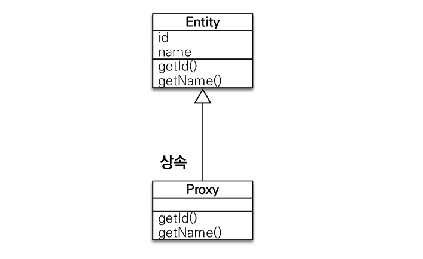
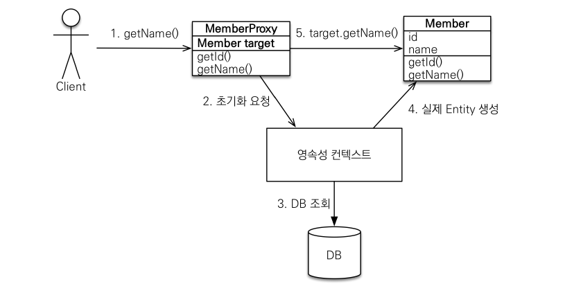

# 챕터8 프록시와 연관관계 관리

### 프록시

객체 그래프 탐색을 할 때, 정보들은 데이터베이스에 있기 때문에 모든 객체들을 자유롭게 탐색하긴 어렵다.

객체 그래프 탐색을 자유롭게 하려면 연관된 모든 객체를 가져와야 한다. 즉, 한번 DB에 접속했을 때 모든 정보를 가지고 와야 하는데, 서버에 큰 부담이 된다.

> 게다가 연관된 모든 엔티티들을 항상 사용하진 않는다.


그렇기 때문에 JPA는 엔티티가 실제 사용될 때 까지 조회를 미루는 지연 로딩을 지연하는데, 지연 로딩에서 사용되는 객체가 프록시 객체 이다.

> **JPA 표준은 지연 로딩의 구현을 JPA구현체에게 위임했다.**
>
> 즉, 지연 로딩의 구현은 JPA 구현체에 따라 바뀔 수 있다는 의미로, 여기선 **하이버네이트 구현체**를 사용한다.

### 프록시 기초

> 참고로 지연 객체는 프록시가 아니라 바이트 코드를 수정해서 사용할 수 있는데, 복잡하기 때문에 프록시만 사용한다.

JPA에서는 식별자로 엔티티를 조회할 때 `EntityManager.find()`를 사용한다.

이런 방식으로 조회하게 되면 영속성 컨텍스트에 값이 없으면 DB를 조회한다.


프록시를 사용해서 엔티티 사용 시점까지 조회를 미루고 싶다면 `EntityManager.getReference()`를 사용하면 된다.

이 메소드를 호출할 때 JPA는 DB를 조회하지 않고, 실제 엔티티 객체를 생성하지도 않는다. 단지 DB 접근을 위임한 프록시 객체를 반환한다.

#### 프록시 특징



프록시 클래스는 실제 클래스를 상속받아 만들기 때문에 겉모습은 똑같다.

그렇기 때문에 신경쓰지 않고 사용하면 된다.


프록시 객체는 실제 객체에 대한 참조를 보관한다.


그렇기 때문에 프록시 객체의 메소드를 호출하면 프록시 객체는 실제 객체의 메소드를 호출한다.

> Proxy.getId() -> Proxy.Entity.getId()


##### 특징

- 프록시 객체는 처음 한번만 초기화 된다.

  즉 하나의 프록시 객체를 여러번 사용해도 DB 접근은 한번이다.

- 프록시 객체가 초기화 되어도 프록시 객체가 바뀌는건 아니다.

  즉 프록시 객체가 초기화 되었어도 우리는 실제 엔티티에 직접 접근하는게 아니라 프록시 객체를 통해 접근한다.

- 프록시 객체는 원본을 상속받은 객체이기 때문에 타입 체크를 할 때 조심해야 한다.

- 영속성 컨텍스트에 해당 객체가 이미 있으면 em.getReference()를 호출해도 실제 엔티티가 반환된다.

- 초기화는 영속성 컨텍스트의 도움이 필요하다.

  즉 준영속 상태의 프록시를 초기화 하면 Exception이 발생한다.

#### 프록시 객체의 초기화

프록시 객체는 실제 사용될 때 DB에 접근해서 초기화 한다.

``` java
Member member = em.getReference(Member.class, "id1");
member.getName();		// 이 시점에서 DB에 접근한다.
```



1. 프록시 객체의 메소드를 호출한다.

2. 초기화 여부를 확인한다. 초기화 되었다면 5번으로 간다.

3. 프록시 객체가 영속성 컨텍스트에게 초기화를 요청한다

4. DB에 조회해서 실제 엔티티를 만든다.

5. 프록시 객체에서 실제 엔티티로 접근해서 해당 메소드를 호출한다.

   > 프록시 객체는 실제 객체에 대한 참조를 가지고 있어서 실제 엔티티의 메소드에 접근이 가능하다.

#### 식별자

엔티티는 프록시로 조회할 때 식별자 값을 파라미터로 전달하고, 저장된다.

그렇기 때문에 `@Access(AccessType.PROPERTY)`로 했다면 `getId()` 메소드는 호출해도 프록시 객체가 초기화되지 않는다.

> 프록시 객체가 이미 식별자를 가지고 있기 때문이다.

`@Access(AccessType.FIELD)`로 설정하면 JPA가 해당 메소드가 id만 조회하는지 제대로 확인이 불가능하기 때문에 초기화해 버린다.

##### 활용

``` java
Member member = EntityManager.find(Member.class, "member1");
Team team = EntityManager.getRefeerence(Team.class, "team1");
member.setTeam(team);
```

위와 같은 방법으로 team을 조회하지 않고도 member의 참조를 변경할 수 있다.

> 여기선 AccessType이 FIELD여도 프록시가 초기화되지 않는다.

#### 확인

JPA에서 `PersistenceUnitUtil.isLoaded(entity)` 메소드를 통해 프록시의 초기화 여부를 확인할 수 있다.

> 초기화 되지 않았다면 false를 반환한다.

조회한 엔티티를 프록시로 확인해 보고 싶다면 직접 출력해봐도 된다.

> 프록시 클래스는 클래스명 뒤에 ..javassist..이라고 되어있다.

##### 강제 초기화

`initialize()` 메소드를 통해 프록시를 강제로 초기화할 수 있다.

JPA 표준에는 따로 강제 초기화 메소드가 없고, `getName()`과 같이 메소드를 호출해야 한다.