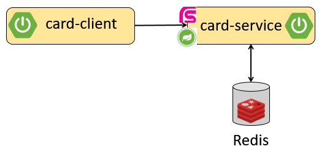
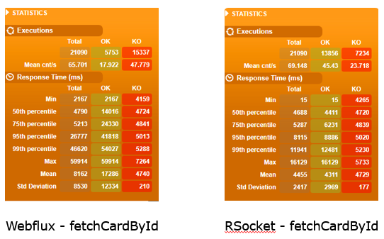
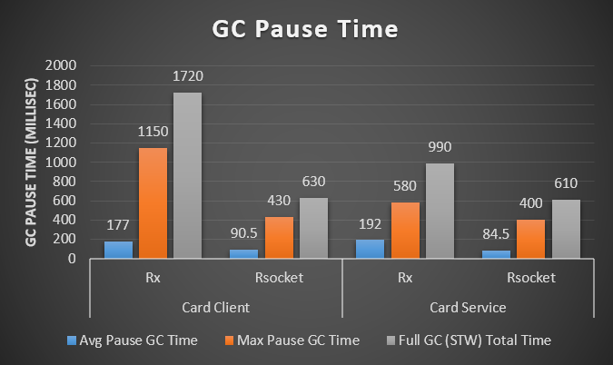
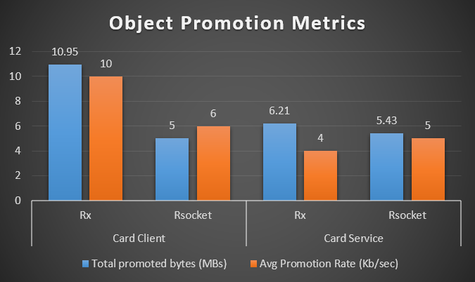

# RSocket

RSocket이란 Websocket이나 TCP처럼 **byte stream transport protocol 위에서 동작**하는 Binary Protocol이다.

RSocket은 **Reactive Stream**을 지원하는 protocol로, Netflix에서 시작되었다.

RSocket은 MSA에서 **오버헤드가 적은 프로토콜로 http를 대체하기 위해**등장했고, Netifi, Facebook 등에서 지원을 받고 있는 오픈소스 프로젝트 이다.

 

RSocket은 다음과 같이 소개된다.

- RSocket은 현대의 Cloud Native나 MSA를 위한 5계층 Application 통신 프로토콜이다.
- HTTP나 gRPC보다 2배 이상의 성능을 보여준다.

RSocket은 Java에선 Project Reactor를 바탕으로 구현되어 있고, Reactor Netty를 통해 transport한다.

 

## Data와 Metadata

RSocket은 payload의 content와 Data, Metadata를 구분하기 위한 메커니즘을 제공하고, Application별로 사용할 수 있도록 지원한다.

Data와 Metadata의 특징은 다음과 같다.

- **Metadata는 Data와 다른 방식으로 인코딩 될 수 있다.**
- **Metadata는 엔티티들에 연관관계 등으로 올 수 있다.**

 

## 특징

### Reactive Stream

Reactive Stream을 지원한다.

 

### Application-Level Flow Control

기존의 TCP에선 Byte 단위로만 지원하던 Backpressure를 Logical 단위로 지원한다.

따라서 우리가 Webflux에서 원하던 수준의 Backpressure를 할 수 있다.

Leasing으로도 Flow Control을 지원한다.

**Reactive Stream 방식**

stream, subscription, channel에서의 flow control에서 사용된다.

Requester가 Responder에게 보낼 수 있는 Payload를 제한하는 방식이다.

> 참고로 Responder에게 할당된 Payload는 반납되지 않고 누적된다.

**Leasing 방식**

한쪽에서 LEASE 프레임을 보내면 시간동안 다른쪽에서 보낼 수 있는 요청의 수를 제한해 준다.

 

### Session Resumption

커넥션을 잃어도 상태를 유지해 준다.

BackPressure와 함께 사용하면 상태를 최소화 할 수 있다.

 

## Intraction Model

OSI 5/6계층에서 동작하며, 다음 4가지 비동기 메세징 Model을 가지고 있다.

- **Request - Response:** 하나의 Stream으로, 하나의 메세지를 보내고 하나의 메세지를 받는다.
- **Request - Stream:** 하나의 메세지를 보내고, 무한한 data stream을 받아온다.
- **Fire-and-Forget:** response 없이 단방향으로 메세지를 보낸다.
- **Channel:** 양방향 Stream으로, 서버와 클라이언트 모두 stream을 전송할 수 있다.

## RSocket Java만의 특징

### Zero Copy

RSocket Java에선 Netty의 ByteBuf Lifecycle을 관리해주는 ZeroCopy를 지원한다.

 

### Automatic Request Batching

RSocket은 자동으로 Network에서 요청을 Batch로 처리하는걸 지원한다.

이것을 통해 RSocket은 network buffer가 가득 찼을 때나 flush가 필요한 경우에데이터를 flush 한다.

 

### Flyweight-Based Frames

RSocket은 Frame의 인코딩/디코딩에서 경량화된 패턴을 사용한다.

경량화된 패턴은 모든 데이터 종류를 허락하진 않지만, ByteBuf 위에서 frame의 디코딩 오버헤드 없이 동작한다,.

 

### RSocket Programming API

RSocket은 OSI 5/6계층 프로토콜임로 직접 사용할수도 있지만 RPC와 IPC와 같은 OSI 7계층 프로토콜로 개발하는게 훨씬 쉽다.

현재 RPC, IPC와 곧 추가될 GraphQL이 있다.

이중에서 가장 성숙한 프로토콜이 protobuf의 자동 직렬화/역직렬화(marshalling) 을 지원하는 RSocket RPC이다.

RSocket RPC는 RSocket 위에서 메세지가 편리하게 지나갈 수 있도록 한다.

핵심은 RPC가 아니다. RPC는 boiler plate 메소드를 만들고, 메세지를 auth-marshal 해주는 메세지 전송 계층이다.

 

## WebClient와 성능 비교

> [다른 블로그](https://www.dhaval-shah.com/performance-comparison-rsocket-webflux/?fbclid=IwAR30wKRC2nlyNoOSKdbu5krULopvYEPCgvEwvlDL_S4X3fdsjsgbaDAsvss)에서 성능을 비교한걸 참고했다.

### 전제조건

위 그림과 같이 한 서버가 다른 API를 호출하는 형태라고 가정한다.

> RSocket이 주로 MSA에서 MicroService간의 통신으로 사용되기 때문이다.

card-service와 card-client는 Webflux로 이루어진 서버로, card-service는 DB에 접근해서 값을 가져오는 로직이 포함되어 있다.

 

### 반응 시간

위에서 볼 수 있다싶이 99 percentile, 즉 99%의 반환 시간을 비교해보면 RSocket쪽이 훨씬 빠른걸 알 수 있다.

최소 반환시간 또한 RSocket이 훨씬 빠르고, 실패율도 절반 밖에 되지 않는다.

 

### GC Pause Time

위 통계에서 볼 수 있다싶이 Webflux쪽이 **훨씬 더 오랫동안 Pause된걸 알 수 있다.**

 

### Young 객체가 Old 객체가 되는 비율

> Old 객체가 되면 GC의 처리 대상이 되기 때문에 낮을수록 좋다.

보다싶이 RSocket쪽이 훨씬 효율적으로 동작한다는걸 알 수 있다.
